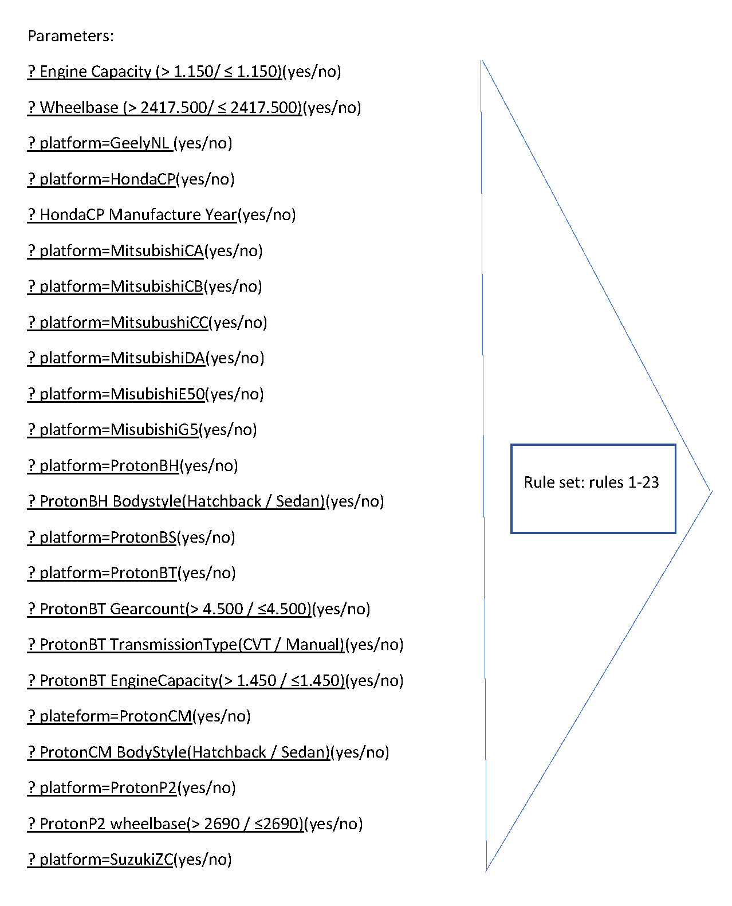

# Introduction
Buying a car is not a small task and it requires a lot of money to do so. From researching the model and specs of the car to placing the down-payment, it is quite a stress to first-timers and it probably reduces the urge to buy the car once it is all settled down.  
To cope with this, we developed a system that allows the user to narrow down the intended cars based on a series of yes and no questions. It allows the reduction of intimidation done towards the user and fosters efficient communication between the salesperson and the customer, as the customer can approach the salesperson already with car model(s) in mind.

# KBS Life Cycle
## Planning
- The plan is to provide the user a with a simple "yes", "no" option expert system in order to enable them to quickly identify the needed car.
- To achieve this, the work was split between 3 group members, with the following proportions (one entry per group member):
  - In charge of knowledge acquisition and related documentation.
  - In charge of programming based on the knowledge base.
  - In charge of the user manual.

## Knowledge Definition
### Source Identification & Selection
- [The wikipedia page for list of proton car models](https://en.wikipedia.org/wiki/List_of_Proton_car_models) was selected as the knowledge source. It is assumed that the page there had all information required for the development of the knowledge base.
- This source was selected due to it being open sourced and comprehensive regarding the cars and their properties.

### Acquisition Analysis & Extraction
- The data was manually converted in to a [json file](./dataSource/carList.json) for easy maintenance, then converted into a [csv file](./dataSource/carList.csv).
- The conversion was done with duplicates for every combination. For example if a car (car A) had options for transmission (Manual, Auto) and assembly country (Malaysia, China), there will be 4 entries as follows:

  | Car Model | Transmission | Assembly Country |
  | --- | --- | --- |
  | A | Manual | Malaysia |
  | A | Manual | China |
  | A | Auto | Malaysia |
  | A | Auto | China |

- The sequence of the entries are not important.
- The csv was then fed into RapidMiner in order to obtain quick prototyping on which criteria had to be asked first.

## Knowledge Representation
### Mockler Chart


### Decision Table


### Production Rules
- ```
  IF engine (capacity of car ≤ 1.150), 
  THEN (car model suggested is Proton   Tiara)
  ```

- ```
  IF (engine capacity > 1.150) AND (wheelbase ≤ 2417.500),
  THEN (car model suggested is Proton Saga 1985)
  ```

- ```
  IF (platform = Suzuki ZC) AND (engine capacity > 1.150) AND (wheelbase > 2417.500),
  THEN (car model suggested is Proton Ertiga)
  ```

- ```
  IF (platform = Proton P2) AND (engine capacity > 1.150) AND (wheelbase > 2417.500) AND (Proton P2 wheelbase > 2690),
  THEN (car model suggested is Proton Exora)
  ```

- ```
  IF (platform = Proton P2) AND (engine capacity > 1.150) AND (wheelbase > 2417.500) AND (Proton P2’s wheelbase < 2690),
  THEN (car model suggested is Proton Preve)
  ```

- ```
  IF (platform = Proton CM) AND (engine capacity > 1.150) AND (wheelbase > 2417.500) AND (Proton CM’s body style = Hatchback),
  THEN (car model suggested is Proton Gen 2)
  ```

- ```
  IF (platform = Proton CM) AND (engine capacity > 1.150) AND (wheelbase > 2417.500) AND (Proton CM’s body style = Sedan),
  THEN (car model suggested is Proton Persona 2007)
  ```

- ```
  IF (platform = Proton BT) AND (engine capacity > 1.150) AND (wheelbase > 2417.500) AND (Proton BT’s gear count ≤ 4.5),
  THEN (car model suggested is Proton Saga 2008)
  ```

- ```
  IF (platform = Proton BT) AND (engine capacity > 1.150) AND (wheelbase > 2417.500) AND (Proton BT’s gear count > 4.5) AND (Proton BT’s transmission type = CVT),
  THEN (car model suggested is Proton Saga FLX)
  ```

- ```
  IF (platform = Proton BT) AND (engine capacity > 1.150) AND (wheelbase > 2417.500) AND (Proton BT’s gear count > 4.5) AND (Proton BT’s transmission type = Manual) AND (Proton BT’s engine capacity > 1.45),
  THEN (car model suggested is Proton Saga 2008)
  ```

- ```
  IF (platform = Proton BT) AND (engine capacity > 1.150) AND (wheelbase > 2417.500) AND (Proton BT’s gear count > 4.5) AND (Proton BT’s transmission type = Manual) AND (Proton BT’s engine capacity ≤ 1.45),
  THEN (car model suggested is Proton Saga 2016)
  ```

- ```
  IF (platform = Proton BS) AND (engine capacity > 1.150) AND (wheelbase > 2417.500),
  THEN (car model suggested is Proton Satria Neo)
  ```

- ```
  IF (platform = Proton BH) AND (engine capacity > 1.150) AND (wheelbase > 2417.500) AND (Proton BH’s body style = Hatchback),
  THEN (car model suggested is Proton Iriz)
  ```

- ```
  IF (platform = Proton BH) AND (engine capacity > 1.150) AND (wheelbase > 2417.500) AND (Proton BH’s body style = Sedan),
  THEN (car model suggested is Proton Persona)
  ```

- ```
  IF (platform = Mitsubishi GS) AND (engine capacity > 1.150) AND (wheelbase > 2417.500),
  THEN (car model suggested is Proton Inspira)
  ```

- ```
  IF (platform = Mitsubishi E50) AND (engine capacity > 1.150) AND (wheelbase > 2417.500),
  THEN (car model suggested is Proton Perdana)
   ```

- ```
  IF (platform = Mitsubishi DA) AND (engine capacity > 1.150) AND (wheelbase > 2417.500),
  THEN (car model suggested is Proton Waja)
  ```

- ```
  IF (platform = Mitsubishi CC) AND (engine capacity > 1.150) AND (wheelbase > 2417.500),
  THEN (car model suggested is Proton Putra)
  ```

- ```
  IF (platform = Mitsubishi CB) AND (engine capacity > 1.150) AND (wheelbase > 2417.500),
  THEN (car model suggested is Proton Wira Aeroback)
  ```

- ```
  IF (platform = Mitsubishi CA) AND (engine capacity > 1.150) AND (wheelbase > 2417.500),
  THEN (car model suggested is Proton Satria)
  ```

- ```
  IF (platform = Honda CP) AND (engine capacity > 1.150) AND (wheelbase > 2417.500) AND (Proton Honda CP’s manufacture year > 2014),
  THEN (car model suggested is Proton Perdana 2016)
  ```

- ```
  IF (platform = Honda CP) AND (engine capacity > 1.150) AND (wheelbase > 2417.500) AND (Proton Honda CP’s manufacture year ≤ 2014),
  THEN (car model suggested is Proton Perdana 2013)
  ```

- ```
  IF (platform = Geely NL) AND (engine capacity > 1.150) AND (wheelbase > 2417.500),
  THEN (car model suggested is Proton X70)
  ```


## Implementation
- The knowledge base was programmed into CLIPS, and a CLIPS interpreter had to be used for inferencing.
- We had decided for the forward inferencing to be a "yes", "no" because of its simplicity in implementation.

## Systems' Testing
- The system was tested with various people and its output recorded. As far as we have tested, there is no discrepancy  between the given result and the actual result.
- As such, we would say that the system is successful  in implementation.

# Conclusions and Future Enhancement
## Conclusion
Via this project, we learnt a lot about the whole Knowledge Based System lifecycle. It is hoped that the knowledge obtained  can be used for other domains.

## Future Enhancement
The following future enhancements' suggestion are as follows:
- The system should be able to accept any numeric value when asking for `wheelbase`, `engine capacity` and `gear count`.
- The system should also be able to accept that the user has unknown car properties.

# User Manual
Refer to [README.md](./README.md).